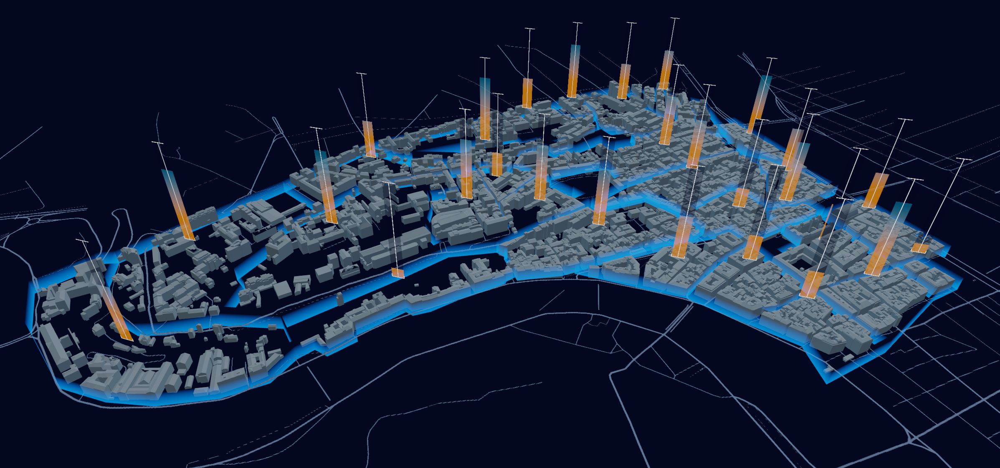

# Internship - Storytelling pour le Patrimoine Culturel

## Objectives
The main aim of this internship is to explore effective ways of visualizing the evolving links between cultural documents and their 3D geographic context in an immersive environment.

## Demonstrations

Research on visualization methods resulted in a series of test demonstrations. These demonstrations are developed in Vl and the source is present in this repository.

The Vl files can be opened and worked using the IDE [VVVV](https://vvvv.org/).

Certain demonstartions require additional libraries to be installed.

To install libraries in VVVV use the nuget package manager.  

Menu / Manage Nugets/ Commandline to opens a terminal in the nugets directory.

For all demonstrations:

[Vl.IO.MouseKeyGlobal](https://github.com/bj-rn/VL.IO.MouseKeyGlobal)

	nuget install VL.IO.MouseKeyGlobal

VideoIn3d and VideoPointCloud:

[Vl.3D.Curve](https://github.com/torinos-yt/VL.3D.Curve)

	nuget install Vl.3D.Curve

VideoPointCloud:

[Vl.IO.PLY](https://github.com/vvvv/VL.IO.PLY)

	nuget install Vl.IO.PLY -pre

[Vl.Fuse](https://github.com/TheFuseLab/VL.Fuse)

	nuget install Vl.Fuse -pre

To use the demos there are 3 files the images should be placed on after cloning the repository,
GeoreferencedImages for images to be displayed in 3D context.
NonGeoreferencedImages for other images.
And VideoSequence to place the video as an image sequence to be used in the demonstration.

## Team
- Akin Gulfidan
- John Samuel
- Vanessa Peña-Araya
- Anastasia Bezerianos
- Gilles Gesquière
